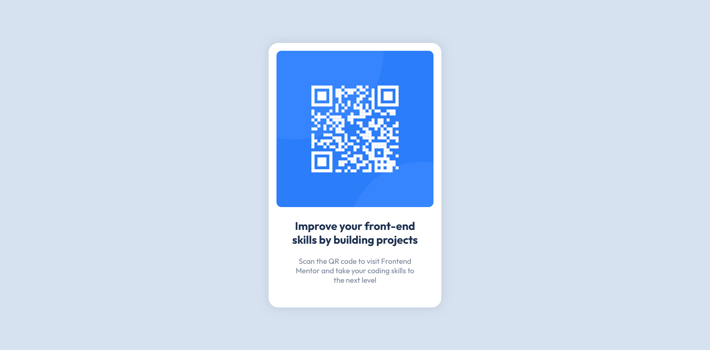

# Frontend Mentor - QR code component solution

This is a solution to the [QR code component challenge on Frontend Mentor](https://www.frontendmentor.io/challenges/qr-code-component-iux_sIO_H). Frontend Mentor challenges help you improve your coding skills by building realistic projects.

## Table of contents

- [Overview](#overview)
  - [Screenshot](#screenshot)
  - [Links](#links)
- [My process](#my-process)
  - [Built with](#built-with)
  - [What I learned](#what-i-learned)
  - [Continued development](#continued-development)
  - [Useful resources](#useful-resources)
- [Author](#author)

## Overview

### Screenshot

### Links

- Solution URL: [github](https://github.com/mihai2537/QR-Code-Component)
- Live Site URL: [live-site](https://mihai2537.github.io/QR-Code-Component/)

## My process

### Built with

- Semantic HTML5 markup
- CSS custom properties
- Flexbox

### What I learned

- border-radius will not round the edges nicely unless you use it on a square.
- Applying the same left padding on siblings h2 and p elements will not show the same output as applying the left padding only on their container.
- Now that I think again, another solution would have been to apply the same inline margin to the siblings.
- Another nice trick that I figured out is to add explicit width and padding to the card. This way you can use width: 100% on the picture.
  I feel like I have better control of the total width in this way.

### Continued development

I'd like to focus more on responsiveness in the future. I think it is not enough what was done for now.

### Useful resources

- [TypeScale](https://typescale.com/) - Helped me establish a font-size scale. I used the Perfect Fifth and a base size of ten.

## Author

- Website - [Mihai](https://github.com/mihai2537/QR-Code-Component)
- Frontend Mentor - [@mihai2537](https://www.frontendmentor.io/profile/mihai2537)
